# Data-Cleaning-Inspecting-and-Wrangling-the-FIFA-21-Data-Using-PowerQuery-In-Excel

## Introduction
Data cleaning and preparation is one of the essential skills you should possess to be considered a skilled Analyst. Recently, A Challenge #DataCleaningChallenge was organized in the Data Community Twitter by Chinonso Promise and Victor Somadina, which aimed to provide an opportunity for every data enthusiast to build a portfolio-worthy project that can be shared with recruiters showcasing their data skill in data preparation and cleaning using any preferred tool such as Excel, Power-Query, SQL, Python, R.

**_Disclaimer_**  The tool used for this challenge is Power-Query editor available in Microsoft Excel and Power BI.

## Task
+ The objective of this challenge is to prepare the data provided for the #DataCleaningChallenge and made it available for analysis by using ETL Approach
+ Ensure that all the columns have the correct data type
- Numerical columns should be in a format suitable for further calculations and analysis
+ Checking the presence of null entries, empty rows, special characters, irregularities, inconsistent naming conventions etc.

## Action
### About the dataset
The FIFA2021 Dataset was originally gotten from Kaggle and can be accessed. [here](https://www.kaggle.com/datasets/yagunnersya/fifa-21-messy-raw-dataset-for-cleaning-exploring) The dataset contains information about 18,979 football players and 77 columns of the players' statistics and demography present in the FIFA 2021 data.

### Data Discovery and Cleaning 
The dataset was brought to excel and imported into the PowerQuery editor, and loaded for transformation using "Get data from Table/Range" 

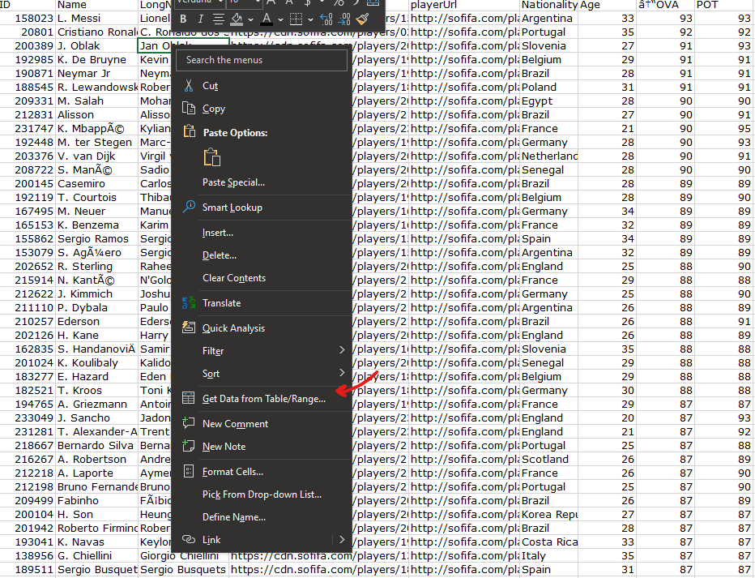

I removed the first 3 columns ("PhtoUrl", "LongName", "PlayerUrl") as it’s not needed for my preparation

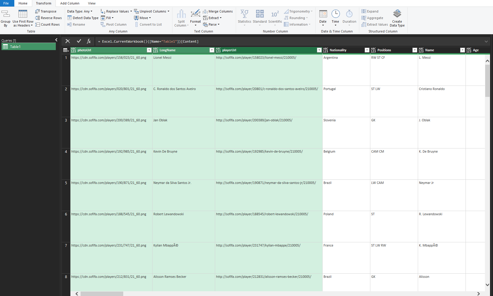

The 'Team & Contract' column had inconsistent values and the wrong data type. The column has 3 categories of values in the format, '23rd July 2020 on loan’, 'Free' and '2018 ~ 2024’ with spaces in between. I used Trim to remove the spaces, then split the column using column from examples(>> from  All Columns) of the Add column tab  then input the 2004 ~ 2021 and FC Barcelona in the new created column(Column 1)
  
 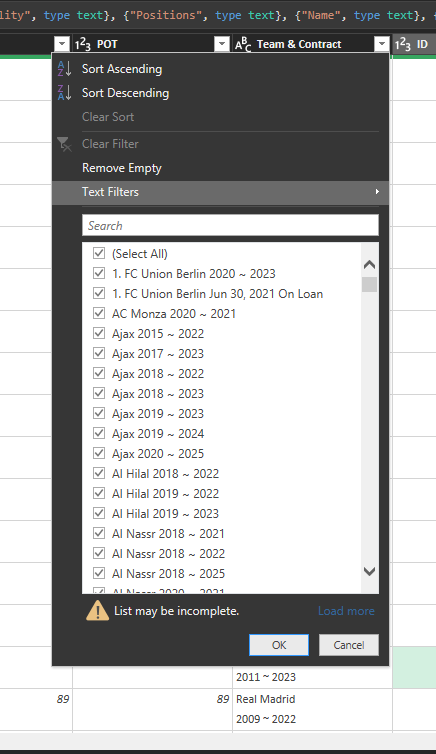  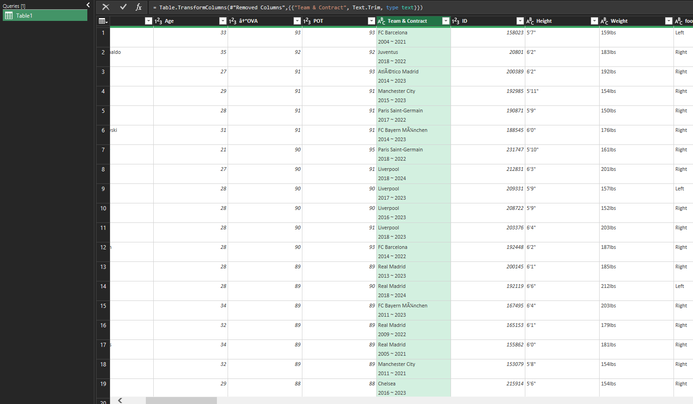 | 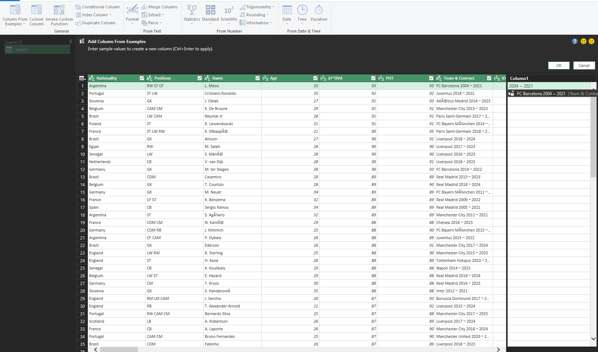    |  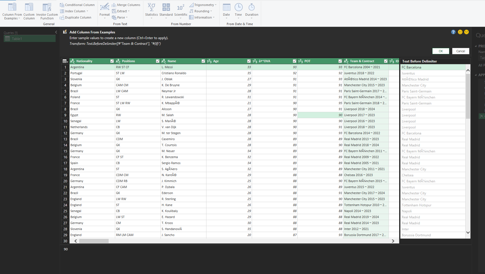 
  
  
 Conditional column called Agreement was created to categorize free, Loan and contract rows in the Team and Contract column 

 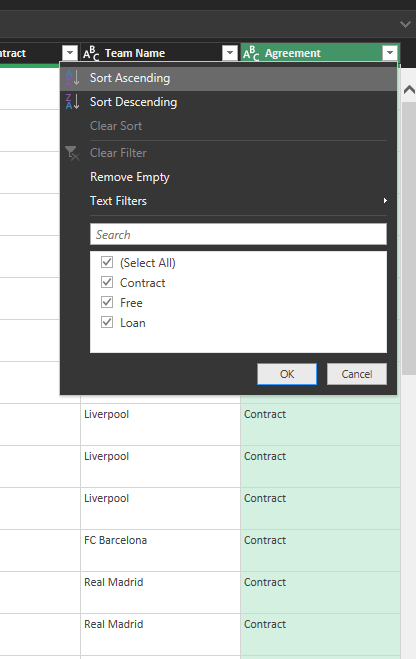
 
 
Moving to the next columns Height & Weight, Height values contain feet & inches values, and Weight values are lbs. I removed the(' & "") in the height column and replace with(. & 'space'), creating two heights column(Height 1 and Heigjt 2) for feet and inches.

    Height and Weight Column                           Splited Height Column                               

  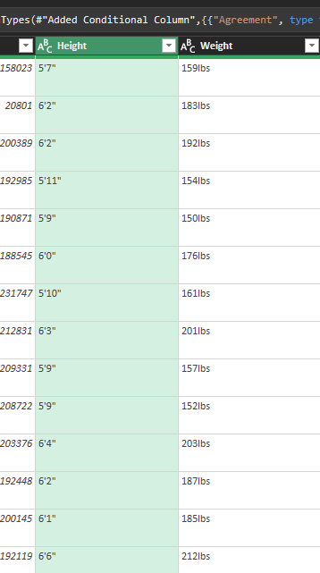   |  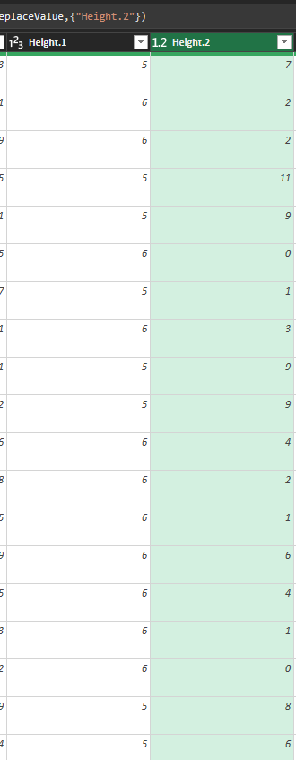
:------------------------------:  | :------------------------------:

Then I converted feet and Inches to cm using the formular 1 feet = 30.48 cm and  1 inch = 2.54 cm, then the two heights column were added together.
 
     Height column convertion to CM                            Height column addition
 
 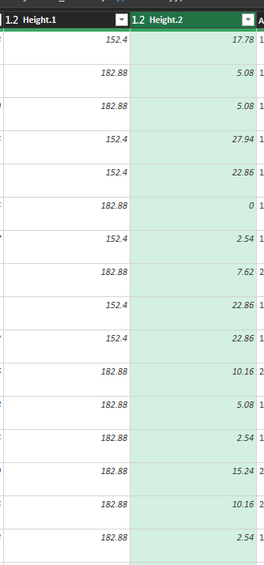        |  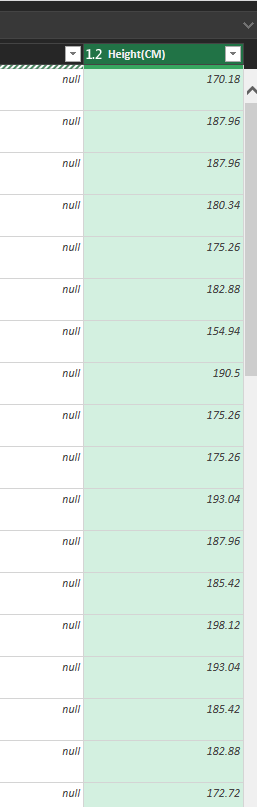
:------------------------------: | :------------------------------:

For the weights column, I used extract function to extract the first 3 numbers. 

  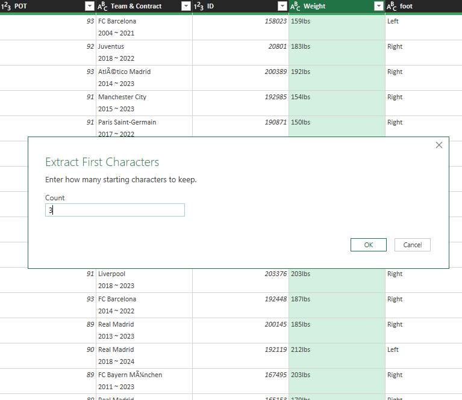  |  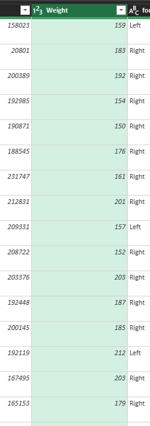
:------------------------: | :-----------------:

Next I move to column BP, it contains an abbreviation of the player's best position, so I want to rename those abbreviations with their necessary word.

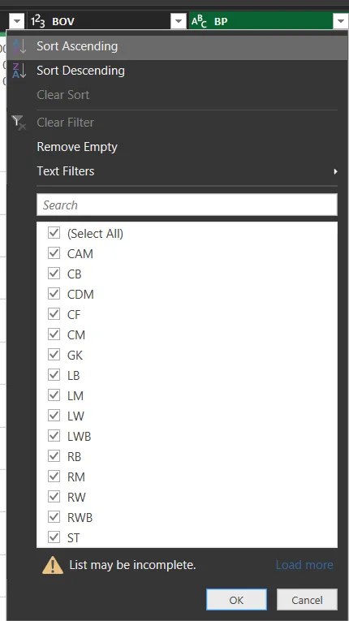

To achieve this, we use the Replace Value function, However that will require replacing each abbreviation and that will take allot of time. So I created a list of variable(BPValues) containing the abbreviations of the player's position with replace words, then I modify the replace value function with Record.FieldorDefault to lookup into the list created.
 
   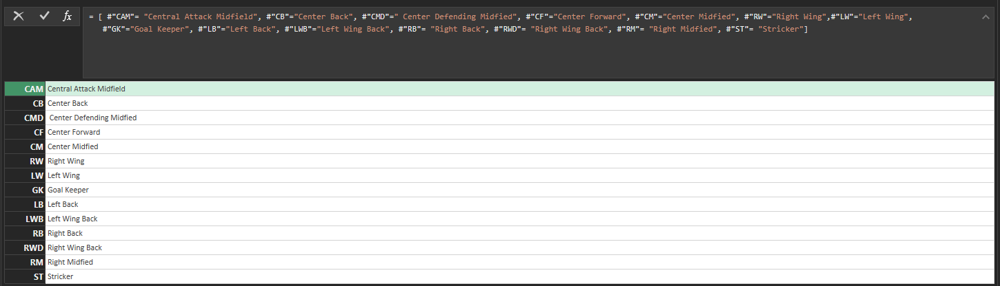  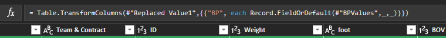  
   
 
The new 'BP' column contain the necessary words.

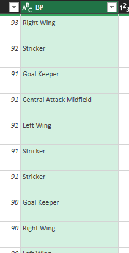   

'Value', 'Wage' and 'Release clause' column were cleaned using the previous approach only that I will only apply one step to the three columns without repeating the same process. What I used here is Extract by Text Between Function.
     Image()     
What I did here was after the first step, I checked the query formula and repeat the same process within the line for other columns you wish to transform. the 'type' means the data type of the column, so I change it to number in the next frame. Boom! I removed the formatted value in the three columns with just one step. 

Image()    Image()

Then I multiplied each column that contain M(Million) by 1000000  and K(Thousand) by 1000... This was done with just a single step.

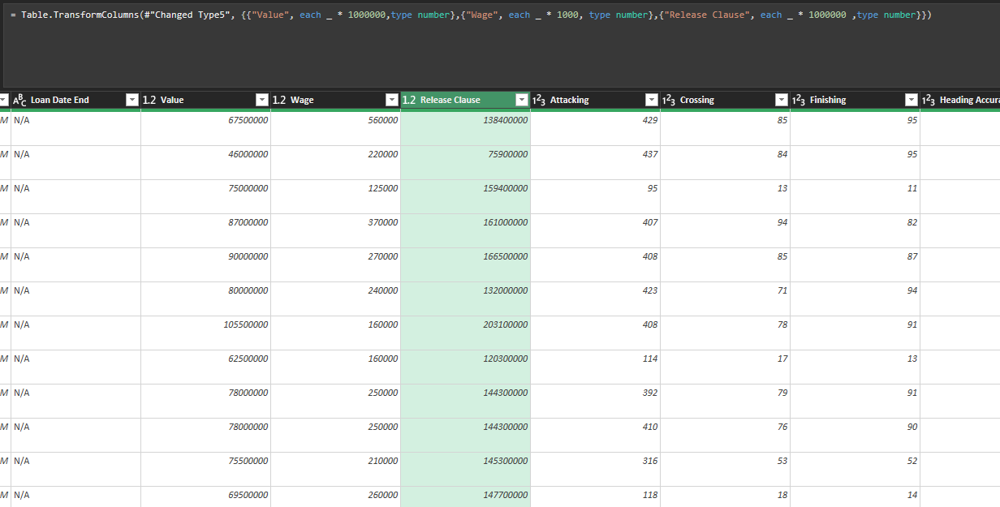 

The same process is applied to the 'W/F', 'SM' and 'IR' columns below. I used the function Text.Start to extract a value in the three columns simultaneously.

  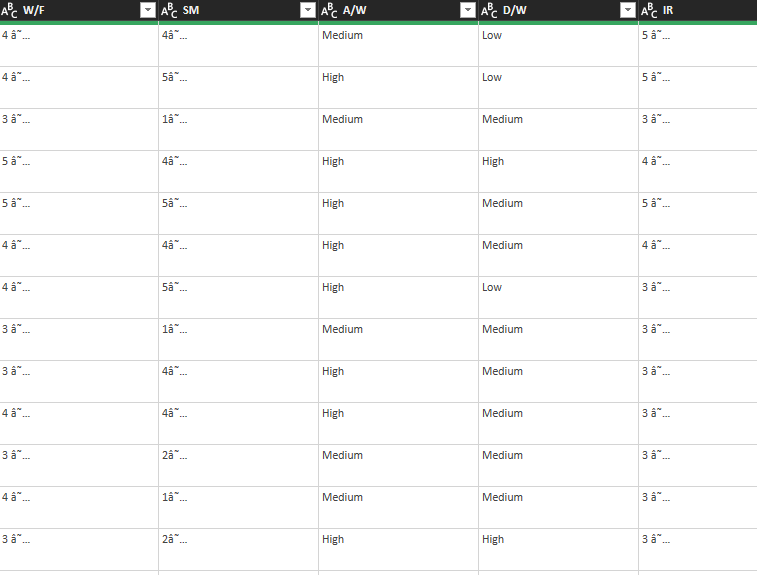       | 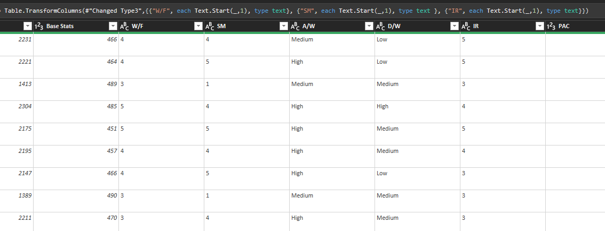 
 :------------------------: |:------------------------:

## Conclusion
Working on this #DataCleaningChallenge help me understand Power Query better. I learned how to modify and minimize applied steps using M Query for Query Optimization and easier transformation practice.Cleaning the FIFA 21 data was a bit challenging, despite the challenges encountered, the messy dataset was transformed into a state that renders it ready for use in analysis.

